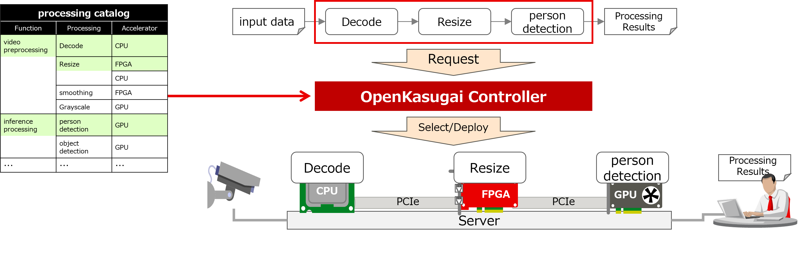

[English](./README.md) / [Japanese](./README_jp.md)

# What is OpenKasugai Controller

The OpenKasugai Controller is an advanced control mechanism that extends the capabilities of Kubernetes, a prominent container orchestrator, to manage disaggregated computing infrastructure. This infrastructure is designed for the high-efficiency processing of geographically dispersed data. The controller aims to optimize resource allocation, enhance scalability, and improve data processing performance across distributed environments. For in-depth information on disaggregated computing infrastructure, please refer to the following resources.

Reference: [https://www.ntt-review.jp/archive/ntttechnical.php?contents=ntr202401fa8.html](https://www.ntt-review.jp/archive/ntttechnical.php?contents=ntr202401fa8.html)

# Objectives and Approaches

OpenKasugai Controller uses three approaches to facilitate data processing using accelerators:
- Catalog proven accelerator processing as abstract functional blocks
- Leverage accelerators to connect cataloged processes to achieve required data processing
- Select the appropriate accelerator/connection type and deploy/connect

# Value Proposition Aiming for

OpenKasugai Controller provides three value propositions:
1. Data flow can be automatically deployed
  - To avoid communication failures and performance degradation due to resource capacity overruns even if the user does not realize it, perform resource management at the deployment destination where data flows are deployed.
  - Choose better devices and routes to use for performance and power consumption so that you can deploy data flows with better performance and power consumption without the user's knowledge.
  - Various scheduling conditions can be prepared in advance so that each dataflow can be deployed with a different scheduling strategy (if desired by the user), and the deployment destination can be selected according to the conditions selected by the user in the dataflow definition.
2. Reduce the amount of manual user changes when changing the environment
  - Automatic collection and resource registration of environment-dependent information from the infrastructure to avoid manual operation by users
  - Reduce user workload by creating common information that does not depend on the environment or DF and performing automatic completion according to the environment or DF
3. Efficient connections between accelerators
  - Reduces processing overhead by DMA data transfer between the FPGA and GPU without CPU processing

# Three Functions of the OpenKasugai Controller

| Function | Description |
|:--|:--|
| Scheduling function | In response to a data flow deployment request, it automatically determines where to deploy each component of the data flow, taking into account the scheduling conditions selected by the user and current usage. It then requests the basic deployment facility to deploy each component of the data flow and delete them in order. You can also register function chain templates and associated functions and connections. |
| Basic deployment function | In response to a deployment or deletion request for each component of the data flow, the deployment or deletion is actually set using various resource controllers. In the case of deployment, if a child bitstream (child bs) is not written to the destination FPGA, it is dynamically written. It also auto-completes the detailed parameters required for various FPGA circuits and pods (For example, channel number, IP address, port number). In the case of deletion, you specify the deletion settings for various resources based on the information at the time of deployment. In doing so, manage the usage so that used resources are not used again. Then, the results of deployment and deletion are provided to the schedule function as the usage status of various resources. It also provides a function to respond to a user's request to manually write child bs or to reset the FPGA or child bs, perform processing, and reflect the result in the usage of various resources. |
| Infrastructure information collection and management function | Provides the ability to automatically gather infrastructure information and create K8s resources automatically. It automates the collection and use of environment-dependent information such as infrastructure configuration information and written area information on K8s, and provides automatic completion of data flow-dependent information (different information for each data flow). |

# Documentations

| Title | Description |
|:--|:--|
|README| This document |
| [Controller](./docs/Architecture/en/OpenKasugai-Controller.pdf)| Describes the basic features of OpenKasugai Controller. |
| [Controller Attachment](./docs/Architecture/en/OpenKasugai-Controller_Attachment1.pdf)| Describes the CR and CM specifications used by OpenKasugai Controller. |
| [Controller Extension](./docs/Architecture/en/OpenKasugai-Controller-Extensions.pdf)| Describes the features for building data flows that branch into multiple functions or that connect functions with different connection types as extensions to OpenKasugai Controller. |
| [ML Framework Integration](./docs/Miscs/apfw/README.md)| Demonstrates how OpenKasugai Controller works with Kubeflow. However, this document assumes an older (unpublished) version of the OpenKasugai Controller, and will require modifications to run on this repository's OpenKasugai Controller. |
| [Install Manual](./docs/InstallManual/en/OpenKasugai-Controller-InstallManual.pdf)| Explains how to build an environment to deploy the sample data flow. |
| [Install Manual Attachment](./docs/InstallManual/en/OpenKasugai-Controller-InstallManual_Attachment1.pdf)| Provides supplementary information about the environment construction procedure and the procedure for customizing the sample data flow. |
| [Demo - multi node](./docs/Demonstrations/en/OpenKasugai-Demo.pdf)| Provides step-by-step instructions for deploying a sample data flow. This is a demonstration using CPU, FPGA, and GPU in a multi-physical node configuration. |
| [Demo - all-in-one (customized kind)](./docs/Demonstrations/en/OpenKasugai-Demo-for-All-in-One.pdf)| You can use a customized kind ([all-in-one](https://github.com/openkasugai/all-in-one)) to run certain demos in a virtual multi-node configuration even if you only have a single physical node. This is a demonstration using CPU and GPU. |

# How to Contribute

Refer to ["Contributing to OpenKasugai Controller"](./CONTRIBUTING.md)

# License

Apache License 2.0
