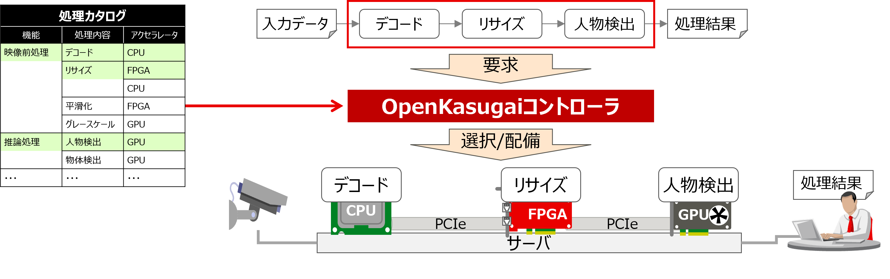

[日本語](./README_jp.md) / [英語](./README.md)

# OpenKasugai Controller とは

OpenKasugai Controllerは、著名なコンテナオーケストレーターであるKubernetesの機能を拡張し、ディスアグリゲーテッドコンピューティングインフラストラクチャを管理する高度な制御メカニズムです。このインフラストラクチャは、地理的に分散したデータの高効率処理を目的としています。このControllerは、リソースの最適化、スケーラビリティの向上、および分散環境におけるデータ処理性能の改善を目指しています。ディスアグリゲーテッドコンピューティングインフラストラクチャに関する詳細情報については、以下のリソースを参照してください。

参考リンク：[https://www.rd.ntt/research/JN202311_23718.html](https://www.rd.ntt/research/JN202311_23718.html)

# 目的とアプローチ

OpenKasugai Controllerは、アクセラレータを活用したデータ処理を容易に使えるようにするために、以下の3つのアプローチを採用しています。
1. 実績のあるアクセラレータ処理を抽象的な機能ブロックとしてカタログ化して活用
2. カタログ化した処理を繋げて必要なデータ処理をアクセラレータを活用して実現
3. 適切なアクセラレータ・接続種別を選択して配備/接続

# 目指している提供価値

OpenKasugai Controller は以下の3つの価値を提供します。

1. データフローの自動配備
  - ユーザが意識しなくてもリソース容量超過による通信失敗・性能劣化を避けるため、データフローを配備する配備先のリソース管理を行います。
  - ユーザが意識しなくても性能や消費電力が良いデータフローを配備できるように、性能や消費電力を考慮した、より良い使用デバイスや経路の選択を行います。
  - (ユーザが望むならば) データフローごとに異なるスケジュール戦略で配備できるように、色々なスケジューリング条件を事前に用意しておき、データフロー定義内でユーザが選択した条件に沿って配備先を選択可能にします。

2. 環境変更時のユーザの手作業による変更量削減
  - 環境に依存する情報をインフラから自動収集・リソース登録することで、ユーザの手作業を回避します。
  - 環境やデータフローに依存しない情報を共通情報化して環境やDFに応じた自動補完を行うことで、ユーザの作業量を削減します。

3. アクセラレータ間の効率的な接続
  - FPGAとGPU間でDMAによるデータ転送を行い、CPU処理を介さないことで、処理オーバーヘッドを削減します。

# OpenKasugai Controller を構成する3機能

|機能|説明|
|:--|:--|
|スケジュール機能|データフローの配備要求を受けて、ユーザが選択したスケジューリング条件や現在の使用状況などを考慮して、データフローの各構成要素の配備先を自動決定します。そして、基本配備機能側にデータフローの各構成要素の配備を要求します。または、削除順序を考慮して各構成要素の削除を要求します。また、ファンクションチェインのテンプレートの登録や、それに伴うファンクションやコネクションの登録も行えます。|
|基本配備機能|データフローの各構成要素の配備・削除要求を受けて、各種リソースコントローラを用いて実際に配備・削除の設定を行います。配備の場合、配備先のFPGAに子ビットストリーム(子bs)が書込まれていなければ、動的に書込みます。また、各種FPGA回路やPodに必要な詳細パラメータを自動補完します（例えば、チャネル番号やIPアドレス、ポート番号）。削除の場合、配備時の情報をもとに各種リソースの削除の設定を行います。その際、使用済リソースが再び使用されないように使用状況を管理します。その後、配備・削除した結果を各種リソースの使用状況としてスケジュール機能側に提供します。また、ユーザからの子bsの手動書込み要求や、FPGAや子bsのリセット要求を受けて、処理を実施し、結果を各種リソースの使用状況に反映する機能も提供します。|
|インフラ情報収集管理機能|インフラ情報を自動収集してK8sリソースを自動作成する機能を提供します。インフラの構成情報や書込まれている領域情報など、環境依存情報の収集とK8s上での活用の自動化や、データフローに依存する情報(データフロー毎に異なる情報)の自動補完を提供します。|

# ドキュメント

|タイトル|説明|
|:--|:--|
|README|本書|
|[コントローラ基本機能](./docs/Architecture/jp/OpenKasugai-Controller.pdf)|OpenKasugai Controllerの基本機能を説明します。|
|[コントローラ基本機能 付録](./docs/Architecture/jp/OpenKasugai-Controller_Attachment1.pdf)|OpenKasugai Controllerで用いられるCRとCMの仕様を説明します。|
|[コントローラ拡張機能](./docs/Architecture/jp/OpenKasugai-Controller-Extensions.pdf)|OpenKasugai Controllerの拡張機能として、複数のファンクションに分岐するデータフローや、接続種別が異なるファンクション同士を繋いだデータフローを構築するための機能を説明します。|
|[MLフレームワーク連携](./docs/Miscs/apfw/README.md)|OpenKasugai ControllerをKubeflowと連携する方法を示します。ただし、このドキュメントは旧版（未公開）のOpenKasugai Controllerを前提としているため、このリポジトリのOpenKasugai Controllerで実行するには改修が必要です。|
|[インストール手順](./docs/InstallManual/jp/OpenKasugai-Controller-InstallManual.pdf)|サンプルデータフローを配備するための環境構築手順を説明します。|
|[インストール手順 付録](./docs/InstallManual/jp/OpenKasugai-Controller-InstallManual_Attachment1.pdf)|環境構築手順の補足説明やサンプルデータフローをカスタマイズする場合の手順を説明します。|
|[デモ - 複数物理ノード](./docs/Demonstrations/jp/OpenKasugai-Demo.pdf)|サンプルデータフローを配備するための実行手順を説明します。複数物理ノード構成でCPU・FPGA・GPUを使用したデモとなります。|
|[デモ - all-in-one (customized kind)](./docs/Demonstrations/jp/OpenKasugai-Demo-for-All-in-One.pdf)|カスタマイズしたkind([all-in-one](https://github.com/openkasugai/all-in-one))を使用して、単一物理ノードしかない場合でも仮想的に複数ノード構成で特定のデモを実行できます。CPU・GPUを使用したデモになります。|

# How to Contribute

[OpenKasugai Controller へのコントリビューション](./CONTRIBUTING_jp.md)をご参照ください。

# ライセンス

Apache License 2.0
